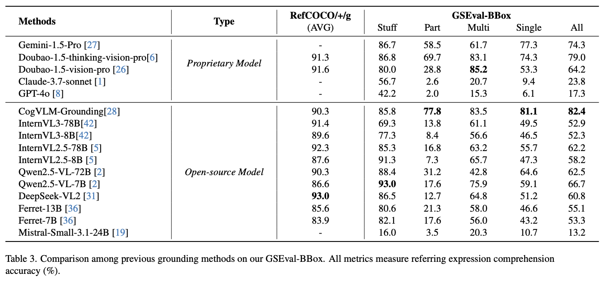

<div align="center">
<h1>GroundingSuite</h1>
<h3>Measuring Complex Multi-Granular Pixel Grounding</h3>

[Rui Hu](https://github.com/isfinne)<sup>1,\*</sup>, [Lianghui Zhu](https://scholar.google.com/citations?user=NvMHcs0AAAAJ&hl=zh-CN)<sup>1,\*</sup>, [Yuxuan Zhang](https://github.com/CoderZhangYx)<sup>1</sup>, [Tianheng Cheng](https://scholar.google.com/citations?user=PH8rJHYAAAAJ&hl=zh-CN)<sup>1,🌟</sup>, Lei Liu<sup>2</sup>, Heng Liu<sup>2</sup>, Longjin Ran<sup>2</sup>,<br>Xiaoxin Chen<sup>2</sup>, [Wenyu Liu](http://eic.hust.edu.cn/professor/liuwenyu)<sup>1</sup>, [Xinggang Wang](https://xwcv.github.io/)<sup>1,📧</sup>

<sup>1</sup> Huazhong University of Science and Technology, <sup>2</sup> vivo AI Lab

(\* equal contribution, 🌟 Project lead, 📧 corresponding author)

<b>ICCV 2025</b>

[](https://arxiv.org/abs/2503.10596)
[](https://opensource.org/licenses/Apache-2.0)

</div>

<div align="center">

</div>

## 📋 News
`[2025-6-26]:` GroundingSuite has been accepted by **ICCV 2025**!\
`[2025-3-14]:` GroundingSuite [arXiv](https://arxiv.org/abs/2503.10596) paper released. Code and dataset are now available!

## 🌟 Highlights

- **Automated VLM Annotation**: A novel VLM-based framework for efficient pixel-level grounding annotation
- **Large-scale Dataset**: 9.56M training samples with diverse referring expressions
- **Comprehensive Benchmark**: 3,800 instances evaluation benchmark for thorough assessment
- **Efficient Annotation**: 4.5x faster annotation compared to GLaMM

## 📝 Introduction

GroundingSuite is a comprehensive pixel grounding framework that addresses the challenges of complex multi-granular pixel grounding. Our framework introduces:

1. An automated VLM-based annotation pipeline that significantly improves annotation efficiency
2. A large-scale dataset with 9.56M diverse training samples
3. A rigorous evaluation benchmark with 3,800 carefully curated instances
4. State-of-the-art performance metrics that demonstrate the effectiveness of our approach

## 🛠️ Pipeline

<div align="center">

</div>

## 📊 Results

<div align="center">

</div>

<div align="center">

</div>

## 📊 Dataset

Our dataset consists of:
- **Training Set**: 9.56M samples with diverse referring expressions
- **Evaluation Benchmark**: 3,800 carefully curated instances

You can download the GSEval from: [Hugging Face](https://huggingface.co/datasets/hustvl/GSEval)

## 🚀 Usage

### Basic Usage

```bash
python evaluate_grounding.py --image_dir ./images --gt_file GroundingSuite-Eval.jsonl --pred_file model_predictions.jsonl
```

### Parameters

- `--image_dir`: Directory containing images (default: current directory)
- `--gt_file`: Path to ground truth JSONL file (default: "GroundingSuite-Eval.jsonl")
- `--pred_file`: Path to model prediction JSONL file (default: "claude_predictions.jsonl")
- `--output_file`: Path for saving evaluation results (default: "[model_name]_result.json")
- `--iou_threshold`: IoU threshold for evaluation (default: 0.5)
- `--vis_dir`: Directory for visualization results (default: "visualization")
- `--visualize`: Enable visualization generation (default: False)
- `--normalize_coords`: Whether prediction coordinates are normalized [0-1] (default: False)
- `--mode`: Evaluation mode ("box" or "mask") (default: "box")
- `--vis_samples`: Number of random samples to visualize (default: 5)

### Visualization Example

Generate visualizations comparing ground truth and predictions:

```bash
python evaluate_grounding.py --image_dir ./images --gt_file GroundingSuite-Eval.jsonl --pred_file model_predictions.jsonl --visualize --vis_dir ./vis_results
```

### Data Format

#### Ground Truth File Format (JSONL)

```json
{"idx": 1, "image_path": "images/example.jpg", "box": [10, 20, 100, 200], "class_id": 0, "label": "dog"}
```

#### Prediction File Format (JSONL)

```json
{"idx": 1, "image_path": "images/example.jpg", "box": [15, 25, 105, 205]}
```

### Evaluation Metrics

- **Box Mode**: Calculates IoU (Intersection over Union) and accuracy (IoU > threshold)
- **Mask Mode**: Calculates GIoU (mean IoU)

## 📚 Citation

If you find GroundingSuite useful in your research or applications, please consider giving us a star ⭐ and citing it using the following BibTeX entry:

```bibtex
@misc{hu2025groundingsuite,
  title={GroundingSuite: Measuring Complex Multi-Granular Pixel Grounding},
  author={Rui Hu and Lianghui Zhu and Yuxuan Zhang and Tianheng Cheng and Lei Liu and Heng Liu and Longjin Ran and Xiaoxin Chen and Wenyu Liu and Xinggang Wang},
  journal={arXiv preprint arXiv:2503.10596},
  year={2025}
}
```
